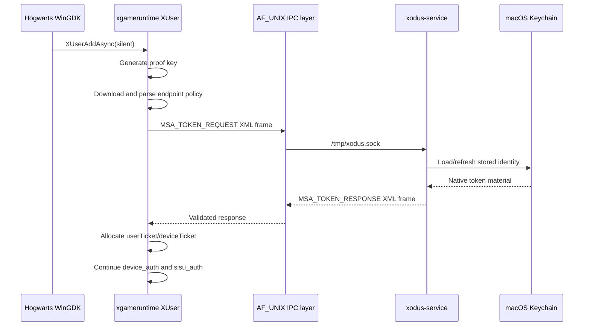

# XUser RPS ticket bridge specification

Status: ready for human clean-room implementation

Owner: unassigned

Related handoff:

- `06-experiment-ledger.md`
- `07-xuser-ticket-clean-room-brief.md`
- `08-subscription-handoff-2026-10-01.md`

## 1. Purpose

Define the behavior, security properties, integration boundary, and acceptance
tests for replacing the public xgameruntime `get_rps_tickets()` stub with a
human-authored bridge to the existing native Xodus service.

This specification intentionally contains no implementation. The xgameruntime
repository prohibits LLM-authored reverse-engineering and API-semantic code.

## 2. Problem statement

Hogwarts Legacy calls:

```text
XUserAddAsync(AddDefaultUserSilently)
```

The public `origin/xuser` implementation successfully:

1. Generates an ECDSA proof key.
2. Downloads the default Xbox endpoint document.
3. Parses endpoint and signature-policy data.
4. Calls `get_rps_tickets()`.

`get_rps_tickets()` currently returns `E_NOTIMPL`, causing user initialization
to fail and the game to retry startup.

The native Xodus service already owns authentication and token refresh. The
runtime must request the required values from that service rather than
duplicating Microsoft authentication inside Wine.

## 3. Scope

### In scope

- Connect to the existing same-user Xodus AF_UNIX service.
- Encode an XML `MSATokenRequest`.
- Send a correctly framed `MSA_TOKEN_REQUEST`.
- Receive and validate `MSA_TOKEN_RESPONSE`.
- Parse XML into the existing public response model.
- Return independently allocated user and device RPS ticket strings.
- Produce explicit failures without exposing secrets.
- Add synthetic unit and integration tests.

### Out of scope

- Microsoft/Xbox authentication implementation in Wine.
- Keychain access from Wine.
- Token refresh logic outside the native service.
- Changes to package licensing or decryption.
- Hardcoded account or device credentials.
- Proprietary runtime tracing.
- Changes to XUser behavior beyond satisfying the existing public function
  contract.

## 4. Existing public interfaces

### Runtime function

```c
static HRESULT get_rps_tickets(
    BOOLEAN allowUi,
    char **userTicket,
    char **deviceTicket
);
```

Caller ownership:

```text
userTicket   freed with free()
deviceTicket freed with free()
```

### Native service endpoint

```text
Socket path: /tmp/xodus.sock
Socket mode: 0600
Transport:   AF_UNIX SOCK_STREAM
```

### Frame

All integer fields are little-endian:

```text
offset  size  field
0       4     magic
4       2     message type
6       2     payload length
8       N     payload
```

Constants:

```text
XML magic:          0x58445358
MSA_TOKEN_REQUEST:  3
MSA_TOKEN_RESPONSE: 4
maximum payload:    65535 bytes
```

### Request model

```rust
MSATokenRequest {
    client_id: String,
    allow_ui: bool,
    msa_full_trust: bool,
}
```

Request sources:

```text
client_id      parsed MicrosoftGame.config MSAAppId
allow_ui       XUserAddOptions_AddDefaultUserAllowingUI
msa_full_trust parsed MicrosoftGame.config MSAFullTrust
```

### Response model

```rust
MSATokenResponse {
    token: String,
    expiry: i64,
    device_rps: String,
    device_expiry: i64,
}
```

Output mapping:

```text
userTicket   <- token
deviceTicket <- device_rps
```

Expiry fields are validation/diagnostic inputs only. They must not be logged
with ticket data.

## 5. Data flow



## 6. Functional requirements

### FR-1: input validation

- Return a failure if either output pointer is null.
- Set both outputs to null before any operation.
- Reject missing or empty `MSAAppId`.
- Preserve the caller's `allowUi` value.
- Use the already parsed `MSAFullTrust` value.

### FR-2: connection

- Connect only to the existing Xodus runtime socket path.
- Do not fall back to TCP, another user, or a world-readable socket.
- Surface connection failures as a failing `HRESULT`.
- Do not present UI when `allowUi` is false.

### FR-3: request serialization

- Serialize exactly one `MSATokenRequest` XML payload.
- Reject serialized payloads larger than `UINT16_MAX`.
- Prefix the payload with the documented XML frame.
- Send all bytes or fail explicitly.

### FR-4: response framing

- Read the complete fixed-size header.
- Validate XML magic.
- Require `MSA_TOKEN_RESPONSE`.
- Read exactly the declared payload length.
- Reject truncation, extra framing inconsistencies, and oversized responses.

### FR-5: response parsing

- Parse the response using the public XML model or an equivalent schema.
- Require non-empty `token`.
- Require non-empty `device_rps` unless maintainers explicitly document an
  allowed alternative.
- Treat malformed expiry fields as a response error.
- Do not accept partial success.

### FR-6: output ownership

- Allocate independent NUL-terminated UTF-8 buffers.
- Buffers must be compatible with `free()`.
- Return `S_OK` only after both outputs are assigned.
- On failure, securely release temporary data and leave both outputs null.

### FR-7: cancellation and timeout

- Do not wait indefinitely for connection, read, or write.
- Use the repository's established IPC timeout policy where available.
- Return a deterministic failure after timeout.

### FR-8: retry policy

- Do not implement an unbounded retry loop inside `get_rps_tickets()`.
- Let the existing XUser/game lifecycle decide whether to retry.
- A partial frame must close/reset the connection before reuse.

## 7. Security requirements

### SR-1: no secret logging

Never log:

- request XML;
- response XML;
- user ticket;
- device ticket;
- ticket length;
- account/XUID/gamertag;
- authorization headers;
- proof-key coordinates;
- Keychain identifiers.

Allowed diagnostics:

```text
connection stage
message type
HRESULT/NTSTATUS
payload validation category without payload size or content
```

### SR-2: memory handling

- Minimize copies of ticket data.
- Zero temporary ticket-bearing buffers before release when practical.
- Free every allocation on all failure paths.
- Never persist ticket material to disk.

### SR-3: socket trust

- Preserve service socket mode `0600`.
- Do not weaken native service permissions.
- Keep Keychain access in the Aqua native service.
- Do not read Keychain material directly from Wine.

### SR-4: malformed input

- Treat the native service response as untrusted input.
- Validate every frame field before allocation or parse.
- Guard integer conversions and `length + header` calculations.
- Reject embedded NUL behavior that would truncate returned strings.

## 8. Error behavior

The human implementation must document the selected public error mapping.
Requirements:

- allocation failure maps to `E_OUTOFMEMORY`;
- invalid caller pointers map to `E_POINTER`;
- unsupported/missing service state returns a failing result;
- malformed frame/XML returns a failing result distinct from success;
- timeout and connection refusal remain distinguishable in diagnostics;
- no error path returns success-shaped empty strings.

Do not guess proprietary XGameRuntime error codes without public evidence.
Generic HRESULT mappings are acceptable pending maintainer review.

## 9. Test specification

All unit tests use synthetic placeholder values such as:

```text
USER_TICKET_TEST
DEVICE_TICKET_TEST
```

No test may read the user's Keychain.

### T-01: valid request fields

Given known `MSAAppId`, `allow_ui`, and `msa_full_trust`, serialization produces
an XML request that round-trips into the public `MSATokenRequest` model.

### T-02: frame encoding

The request frame contains:

```text
magic 0x58445358
type 3
exact payload length
exact payload bytes
```

### T-03: valid response

A synthetic type-4 response returns:

```text
S_OK
userTicket == "USER_TICKET_TEST"
deviceTicket == "DEVICE_TICKET_TEST"
```

Both outputs are independently freeable.

### T-04: socket unavailable

Missing socket returns failure and both outputs remain null.

### T-05: wrong magic

Response with incorrect magic is rejected.

### T-06: wrong response type

Any response other than type 4 is rejected.

### T-07: truncated header

Every header length from zero through seven bytes is rejected without an
out-of-bounds read.

### T-08: truncated payload

A declared payload longer than received data is rejected.

### T-09: malformed XML

Malformed XML is rejected and outputs remain null.

### T-10: empty user ticket

An empty `token` field is rejected.

### T-11: empty device ticket

An empty `device_rps` field is rejected unless maintainers explicitly approve
that state.

### T-12: maximum payload

A valid maximum-size frame is bounded and handled without integer overflow.

### T-13: allocation failure

Injected allocation failure returns `E_OUTOFMEMORY` and releases all prior
allocations.

### T-14: silent mode

`allow_ui == FALSE` is preserved in the request and no UI is displayed.

### T-15: logging redaction

Captured test logs contain none of the synthetic ticket values or request/
response XML.

### T-16: ownership

Success outputs can be freed in either order. Failure outputs are null.

## 10. Integration validation

Prerequisites:

```text
com.xodus.service running in Aqua
/tmp/xodus.sock mode 0600
synthetic tests passing
private runtime installed
```

Run with only:

```text
WINEDEBUG=+xgameruntime,+gdkc
```

Success criteria:

1. No `get_rps_tickets ... stub!` line.
2. `XUserAddAsync` progresses into `device_auth`.
3. No ticket/token material appears in logs.
4. The runtime does not regress:
   - task-queue creation;
   - ECDSA key generation;
   - Schannel endpoint request;
   - endpoint JSON parsing.
5. The next failing public API boundary is documented before further semantic
   implementation.

## 11. Implementation phases

### Phase A: maintainer coordination

- Confirm no duplicate implementation exists.
- Confirm the intended service message contract.
- Confirm acceptable generic HRESULT mappings.
- Assign a human clean-room implementer.

### Phase B: synthetic protocol tests

- Add fixture encoder/decoder tests first.
- Cover T-01 through T-16 without live credentials.

### Phase C: transport implementation

- Connect, write complete frame, read complete response.
- Add strict validation and bounded timeout behavior.

### Phase D: ownership and redaction review

- Audit every success/failure path.
- Verify outputs and temporary buffers.
- Verify logs.

### Phase E: live integration

- Run through the Aqua service.
- Capture only redacted milestone evidence.
- Stop at the next semantic stub.

## 12. Review checklist

- [ ] Human clean-room authorship confirmed.
- [ ] Maintainer coordination recorded.
- [ ] No proprietary tracing or disassembly used.
- [ ] No authentication flow duplicated in Wine.
- [ ] Synthetic tests cover malformed frames.
- [ ] Outputs are null on every failure.
- [ ] Both outputs are independently freeable.
- [ ] No secret logging.
- [ ] No disk persistence.
- [ ] Socket permissions unchanged.
- [ ] Silent mode does not display UI.
- [ ] Native Xodus tests still pass.
- [ ] Runtime integration advances beyond the stub.
- [ ] Experiment ledger updated.

## 13. Definition of done

The issue is complete only when:

1. A human-authored implementation has maintainer approval.
2. Synthetic protocol and security tests pass.
3. Existing Xodus native tests pass.
4. A live redacted integration run reaches `device_auth`.
5. No ticket/token data is logged or persisted.
6. The next blocker, if any, is documented.

