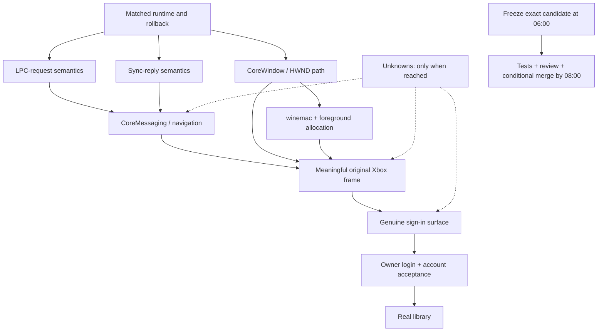

# Original Xbox PC app: remaining-milestone plan

Updated: 2026-10-07. Target: the original `XboxPcApp.exe`, application
`Microsoft.Xbox.AppL`, not the Xodus UI, CE sidecar, installer or a replacement
authentication flow.

## Ground truth

| Milestone | Current evidence | Remaining acceptance |
|---|---|---|
| 1. Installer UI | Verified original installer rendering | Preserve evidence; installation is a separate requirement |
| 2. Registered identity | Verified local DeveloperUnsigned catalog/token identity | Do not claim Store installation, licensing or private capabilities |
| 3. Process alive >10 seconds | Sprint 2026-10-07 (gui4/sp46/sp47): original child stays alive about 70 s with no missing API, then its launcher ends it (exit 92). Historical 11.002 s and 7.349 s results are superseded | Lifetime alone is not responsive startup; it is **not** counted as passed while no window exists |
| 4. Original window | **FAIL/UNTESTED**: no CoreWindow; XAML renders only into the hidden DXGI device window. Documented activation route is a NO-GO boundary (Phase 3 below) | Original visible window and meaningful frame, associated with the genuine child |
| 5. Microsoft sign-in page | Not observed | Original app opens its genuine Microsoft authentication surface |
| 6. Signed in | Not observed | Human completes authentication; original app accepts the genuine session |
| 7. Library | Not observed | Original authenticated library finishes loading with real account-backed data |

The canonical Run remains `xbox-pc-app-crossover-20261005`; its primary criterion
is `XBOX-APP-LIBRARY`. The Run's broader play/download criterion is not silently
completed or removed by this plan.

**Current blocker (2026-10-07 ~21:00): launch activation and the original window.**
The `STATUS_SERVER_SID_MISMATCH` blocker described in the next paragraph was
resolved in sprint Phase 1. The original app now gets through the headless
startup chain and stays alive without a window. The documented
`ActivateApplication` route requires the Shell Infrastructure Host's
activation manager (see the Phase 3 activation experiment below).

*Superseded (kept for history):* the blocker was **the registrar server's
restricted service principal**.
The measured `QueryTransientObjectSecurityDescriptor` implementation reads the
authentic installed `WM_RegistrarServer` default successfully. The port-flags
candidate permits the genuine service to report RUNNING, but the original
client's unchanged server requirement rejected its actual process token with
`STATUS_SERVER_SID_MISMATCH (0xc00002a0)`. Neither service RUNNING nor standalone
controls establish original-app startup.

## User-directed feasibility audit: 2026-10-07

Normal implementation is paused. Independent adversarial assessment is
**REVISE**. The last day produced real prerequisite progress on the original
path, including genuine registrar RUNNING, but no newly accepted original
window, sign-in, account or library milestone. The latest original child exits
after 7.349 seconds with the unchanged `STATUS_SERVER_SID_MISMATCH` blocker.

The audit extended the restriction POC to 32 native/Wine cases and found four
access-mask differences in the experimental candidate. A one-line correction
in a separate audit-only COW stage matches all 32 native cases; it is not
integrated or a service-principal fix. Another POC launched an actual child
under a caller-owned primary token and preserved its identifier and zero
privileges, without constructing a service identity. The existing builtin
account route instead returns logon success with an invalid token (error 6);
SCM SID-type query fails with error 124. Those placeholders cannot be reused
as a truthful issuer.

**Decision:** NO-GO for open-ended original-app delivery on Wine;
BOUNDED_GO only for one faithful SCM principal/startup experiment with an
explicit exit criterion. Do not resume perpetual helper work, fabricate a
LocalService identity, relax the descriptor or count helper success as a
window/library result. The next proof must be the real configured principal
accepted by the unchanged original client and observable startup progress.

A materially different delivery route is a genuine Windows 11 ARM VM or the
existing native Windows reference, not a custom Xbox UI. Microsoft announced
[native ARM Xbox/Game Pass support on January 21, 2026](https://blogs.windows.com/windowsexperience/2026/01/21/play-more-xbox-app-is-now-available-on-arm-based-windows-11-pcs/);
historical ARM installation failures are not current universal evidence.
[Parallels requirements](https://kb.parallels.com/en/124223) cover Apple
silicon and macOS 27. App/sign-in/library must still be tested in the actual VM;
native ARM game compatibility is not a guarantee of VM graphics or anti-cheat
support. No VM was installed or account authenticated during this audit.

Detailed audit evidence is preserved privately as
`xbox-feasibility-audit-20261007.json` and `audit-*.log` in the parent session's
files directory. Normal product automation stays off pending the owner's
decision. The original Xbox outcome remains unfinished.

## Windows 11 ARM VM result: 2026-10-07

Parallels Desktop 27.0.2 on the M5 Max (macOS 27.0.1) created a Windows 11
ARM VM from Microsoft's official 26H2 ARM64 image (build 26300.9457). The
genuine Store-signed Xbox app `Microsoft.GamingApp 2609.1001.16.0 Arm64` was
installed from the Store with `winget`. Gaming Services 38.116.6003.0
installed after the owner approved its UAC prompt. The owner then completed
the genuine Microsoft sign-in.

The original Xbox app now shows the signed-in profile with Game Pass Ultimate,
Home, Game Pass, My Library, Cloud Gaming, Store, Most Recent and Play history.
The owner handled all credentials; nothing was imported or faked. Screenshot:
`win11-xbox3.png` in the parent session's private files.

This proves milestones 4–6 and account-backed app data in a VM. It does not
prove any game runs in the VM. Each title still depends on graphics,
anti-cheat and ARM compatibility.

Game test: the Parallels GPU exposes DirectX feature level 11_1 maximum
(WDDM 2.0); there is no DirectX 12. That rules out DX12-only titles such as
Hogwarts Legacy in this VM. Balatro (Game Pass, x64 under Prism) installed
through the Xbox app. Its first launch failed with `gamingservicesui.exe`
`0xc000007b`. Installing Microsoft's signed Visual C++ 2015+ runtimes (ARM64,
x64, x86) fixed it. On relaunch, `love.exe` ran with window title `Balatro`,
stayed responsive for 82 seconds and used CPU. The host screen capture of the
fullscreen game is black, so in-game rendering was not verified from the
host. The owner then visually confirmed on the Mac that Balatro is running
and rendering in the Parallels window.

## Owner preference and route decision: 2026-10-07

The owner prefers running the original Xbox app natively on macOS, with no VM.
That remains the target, but evidence supports only a time-boxed native step:

1. **Native (preferred, uncertain):** one bounded experiment that issues a
   real, configured, restricted service principal through SCM. It reuses the
   audit-only access-mask correction only once the reached code path needs it.
   - **Pass:** the unchanged original app gets past the 7.3 s
     `STATUS_SERVER_SID_MISMATCH` exit and makes observable new startup
     progress.
   - **Stop:** the same exit persists, or reaching it requires a fabricated
     identity or a weakened descriptor.
   - **Time-box:** about one working day.
   - **Scope after a pass:** only the original window, sign-in and library
     milestones are in scope. Installing titles *through the original app*
     depends on Gaming Services kernel drivers, which Wine cannot host.
2. **Game Pass play on macOS (already proven, independent of the Xbox app):**
   the Xodus runtime acquires each package directly from Microsoft and uses
   the account's genuine licence. Two results, each per title:
   - Xbox-PC Hogwarts Legacy reached shader preparation, the character
     creator, the carriage cinematic and the opening world on GPTK 4.
   - Xbox-PC No Man's Sky reached gameplay with genuine account sign-in.

   This is the primary macOS route for Game Pass titles.
3. **Windows reference only:** keep the Parallels Windows 11 ARM VM to
   measure native behaviour. It is not a player route, because Xodus already
   covers the owner's games on macOS.

Open-ended Wine helper work stays cut.

## 24-hour intensive sprint plan (owner-requested 2026-10-07)

**Goal:** move the unchanged original Xbox app as far up the milestone ladder
as possible in 24 hours of focused work, without faking anything.

**Starting point:**
- The genuine `CoreMessagingRegistrar` service reaches RUNNING.
- The original app exits after 6.5–7.3 s, because `NtAlpcConnectPortEx`
  returns `STATUS_SERVER_SID_MISMATCH`.
- Wine SCM launches every service with the launcher's token. It does not
  create the `NT SERVICE\CoreMessagingRegistrar` restricted principal.

**What is new:** the Parallels Windows 11 ARM VM is a native reference we
control, with administrator rights. That allows measuring the *actual* service
token (user, groups, restricting SIDs, flags), plus ALPC and service behaviour.
Earlier attempts to inspect the real service token were denied (error 5).

**Two lanes only:**
- **Lane A (Mac, implementation):** the matched experimental runtime in an
  owned copy-on-write stage. Other games' bottles and prefixes are untouched.
- **Lane B (VM, native reference + upstream check):** read-only measurements
  and source search that feed Lane A. Lane B never ships code.

### Phase 0 — baseline (h0–h1)
- Snapshot the current runtime, prefix and port-flags candidate (rollback
  point).
- Reproduce the exit with a focused trace (ALPC, token, SCM channels only).
- Lane B: dump the real `CoreMessagingRegistrar` host token in the VM:
  user, groups and attributes, restricting SIDs, write-restricted flag,
  integrity level, privileges, and its logon SID.

### Phase 1 — faithful restricted service principal (h1–h8)
- **wineserver token:** store restricting SIDs, return them from
  `TokenRestrictedSids`, and apply native's second access-check pass. Integrate
  the audit's corrected access mask, which matched all 32 native cases.
- **SCM:** read the configured account and `ServiceSidType`. Build the primary
  token measured in Phase 0 (LocalService user, deterministic service SID,
  restricting SIDs). Start the service host through the existing owned
  primary-token launch path, which the audit already proved.
- **Controls:** a native/Wine token-comparison test plus the 32-case access
  matrix.
- **Retry the original app immediately.**
- **Checkpoint h8:**
  - **Pass:** the app gets past `STATUS_SERVER_SID_MISMATCH`.
  - **Fail:** the same exit persists, or getting past it needs a faked SID or a
    weakened descriptor. Stop the sprint and report.

### Phase 2 — follow the next real failures (h8–h16)
- Take only the first failing call on the original path.
- For each failure, follow the upstream-first rule: Wine master, author
  branches, staging, Proton, CodeWeavers, then ReactOS. Reuse if found,
  otherwise implement against VM-measured behaviour.
- **Time-box:** 3 hours per blocker. Over the limit, record it and stop that
  blocker.
- Likely areas, until observed: more CoreMessaging/ALPC, then XAML/WinUI
  composition, DirectComposition and DWM-like APIs.
- **Checkpoint h12:** report. If foreground is needed, ask the owner to free
  the Mac screen.

### Phase 3 — window attempt (h16–h22)
- Enable the matched `winemac.drv` and relaunch the genuine app.
- Capture the window of the original child process only.
- **Pass:** a real Xbox window with a meaningful frame (milestone 4).
- If the window appears early, try the Sign in action once and identify the
  host (WebView2 or WAM). Credentials are entered only by the owner.

### Phase 4 — wrap-up (h22–h24)
- Report the milestone ladder, APIs fixed with their upstream sources,
  evidence paths, and a remaining-blocker estimate.
- Give a GO/NO-GO for continuing.
- Freeze candidates. Integration and PRs happen only if the owner continues.

**Honest odds (estimates, not measurements):**

| Outcome within 24 h | Odds |
|---|---|
| Past `SERVER_SID_MISMATCH` | likely, about 60–70% |
| Original window visible | about 20–30% |
| Sign-in page | under 10% |
| Signed-in library | very unlikely |

Installing or playing games through the original app needs Gaming Services
kernel drivers. That is out of scope for this sprint; Xodus remains the play
route.

**Hard rules for the sprint:**
- No fake service, account, licence or security results.
- No descriptor relaxation and no SID spoofing.
- Other games' bottles and prefixes are untouched.
- Every slice gets a focused control plus an immediate original retry.
- Helper-test success never counts as an app milestone.

### Sprint progress: Phase 1 checkpoint (2026-10-07 ~14:10, before h8)

**Result: Phase 1 passed.** The original app is past
`STATUS_SERVER_SID_MISMATCH`. The registrar runs with a LocalService token
that matches native except for the gaps recorded below. The app's ALPC
connect to
`\BaseNamedObjects\CoreMessagingRegistrar` now returns success; before, it
returned `0xc00002a0`.

**Upstream decision.** Wine, wine-staging, Proton and ReactOS do not issue
per-service LocalService tokens with service SIDs or write restriction.
- Upstream has only the primitives: `RtlCreateServiceSid` (Wine 8148f4e4),
  `NtCreateToken`, and `NtFilterToken`/`CreateRestrictedToken`.
- `SERVICE_CONFIG_SERVICE_SID_INFO` is a FIXME that returns success (Wine
  95295dcf, WineHQ bug 42792). ReactOS launches services with
  `LogonUserW`/`CreateProcessAsUserW`, without service SIDs.

Implemented against native VM measurements instead, reusing those primitives.

**Changes (stage `xbox-service-principal-20261007-001`):**
- `programs/services/service_token.c` (new): the SCM issues the primary token
  for LocalService services with `ServiceSidType` 1 or 3.
  - Native group set and order, with the service SIDs of the svchost group
    members (attribute `0xe` for the started service), the logon SID, and
    `S-1-5-33`.
  - LocalService privileges by well-known LUID, filtered by the group's
    `RequiredPrivileges` union.
  - Default DACL: SYSTEM, OWNER RIGHTS and the member service SIDs.
  - Type 3 adds `WRITE_RESTRICTED` with restricting SIDs {member service SIDs,
    Everyone, logon SID, `S-1-5-33`}.
  - Services with type 0 or another account keep the previous behaviour.
- `server/token.c`: write mask = `mapping->write | DELETE | WRITE_DAC |
  WRITE_OWNER`. This is the audit-stage correction that matched 32/32 native
  cases.
  - *Superseded (R4, 2026-10-07):* the mask is now the measured overlap mask
    (`patch-write-mask.py`, `native-write-overlap.txt`). The 32/32 claim no
    longer applies.
- `server/alpc.c`: the creator of a new ALPC connection port gets
  `PORT_ALL_ACCESS` without a check against the port's own DACL.
  - Native measurement: `0x001f0001` with an empty DACL, a read-only DACL, and
    the exact registrar DACL, including under a write-restricted token.
  - Write restriction is enforced by the parent `\BaseNamedObjects` create
    check, which native satisfies through the Everyone restricting SID.

**Token parity against native.** The following match native:
- User, owner and primary group.
- Core groups and their order.
- Registrar service SID, logon SID attributes, and write restriction.
- Default DACL shape.
- The 11 privileges.

Recorded gaps:
- The DPS, pla and NcdAutoSetup SIDs are absent because those services aren't
  registered in the prefix.
- The 8 `S-1-5-32-<hash>` capability SIDs are missing.
- Session is 1, not 0.
- Reported integrity is 12288, not 16384.
- AuthId is assigned by the server, not `0:3e5`. *Superseded:*
  `service_token.c` now uses `LOCALSERVICE_LUID {0x3e5,0}`.
- `NtCreateToken` doesn't check privilege (pre-existing).
- Wine does not check the parent directory's create access (pre-existing, more
  permissive than native).

**Original-app ladder after Phase 1:**

| Rung | Before | Now |
|---|---|---|
| Packaged activation and claims | pass | pass |
| Registrar service running | running as admin token | running as LocalService principal |
| ALPC connect to registrar | `0xc00002a0` | success |
| Process lifetime | exits at ~7.5 s with `0xE0464645` | alive for 60 s (harness timeout) |
| Original window (milestone 4) | — | **untested**: headless run, no display driver |

The 60 s lifetime is not evidence of UI startup. The next rung needs Phase 3
(`winemac.drv` on the Mac foreground), which needs the owner's release of the
screen.

### Sprint progress: Phase 2 checkpoint (2026-10-07 ~17:30, headless)

**Result: the headless chain reached the display boundary.** Runs sp13–sp23
followed the first real failure each time. Each was resolved upstream-first
or against native VM measurements, with probe parity. Details, provenance and
deviations are in `scripts/macos/compatibility/xaml-startup/README.md`.

Reached and resolved:
- combase design mode and process events
- `GetQueueStatusReadonly`
- `Windows.UI.Xaml.FrameworkView` registration
- `IsOneCoreTransformMode`
- `PrivateCoInternetCombineIUri`: backport of Wine `949c1ed5`
- `GetUserColorPreference`
- `GetColorFromPreference`: measured types only; others return magenta with
  a FIXME
- `RtlGetAppContainerNamedObjectPath`

sp23 reaches no further unimplemented API. The Xaml render thread fails to
create a DXGI factory (`0x887a0004`), because there is no display driver and
the headless harness disables `winemac.drv`. It then calls
`RaiseFailFastException`, and the process exits with `0xC0000602`.

| Rung | Status |
|---|---|
| Packaged activation, registrar, ALPC | pass |
| CoreApplication / Xaml framework startup (headless) | reaches rendering-device creation |
| Original window (milestone 4) | **UNTESTED**: needs Phase 3 with `winemac.drv`, which needs owner permission |
| Sign-in, library, play | UNTESTED |

*Superseded by the Phase 3 checkpoint below.* The display boundary was
crossed with a headless MoltenVK D3D11 device. The 7.3 s
`SERVER_SID_MISMATCH` exit was superseded by Phase 1.

### Sprint progress: Phase 3 checkpoint (2026-10-07 ~20:30)

Runs sp24–sp46 (headless) and gui2–gui4 (`winemac.drv`, after the Exodus lane
released the foreground) followed the next real failure each time. The ladder
and provenance are in `scripts/macos/compatibility/xaml-startup/README.md`.

| Rung | Status |
|---|---|
| Packaged activation, registrar, ALPC | pass |
| CoreApplication / Xaml startup, D3D11 device | reached; no missing API after sp46 |
| Process lifetime | alive about 70 s, then the launcher ends it (exit 92) |
| Original window (milestone 4) | **FAIL/UNTESTED**: no CoreWindow; XAML renders only into the hidden DXGI device window |
| Sign-in, library, play | UNTESTED |

The earlier "window rendered" (sp36) claim is withdrawn.

**Leading hypothesis:** no launch activation arrives, so the app never
creates its CoreWindow.
- This is supported by the original app's PDB symbols and stacks.
- It is **not** proven until a change to activation input changes the
  observed outcome.

**R4 qualification:**
- Paired native/Wine rerun of 71 probe invocations: 28 match after
  normalisation. The other diffs are environment or identity values, or
  documented semantic gaps on paths the app did not reach.
- Deviations are recorded in the README:
  - the CoreMessaging drain FIXME;
  - the IOCP is not closed at thread exit;
  - `msg->id` validation;
  - the Phase 1 token scope;
  - the creator's ALPC grant.

**Incident:** an experimental run crash-looped `winedbg --auto`, reaching
about 770 processes in 4 minutes and hitting the per-user process limit.
- Contained by terminating that run's own process tree.
- AeDebug is now empty, and every run goes through `guard.sh`.

**Next (CTO-bounded, inside the original deadline of 2026-10-08 13:39):**
one experiment through the documented `IApplicationActivationManager::ActivateApplication`
with genuine package identity.
- Upstream check first.
- Observation: does the activation reach the app, and is CoreWindow
  creation attempted?
- Stop with a boundary report (NO-GO/pivot) if the experiment needs explorer,
  ApplicationFrameHost RPC, window bands, a private shell protocol or a
  success factory.
- No 6 h shell-recreation lane.

### Sprint progress: activation experiment and R4 fixes (2026-10-07 ~21:00)

**Activation experiment: NO-GO (stop S1).** Observations and stops were
declared before it ran. Details are in the README section "Activation
boundary".
- `ActivateApplication` → in-proc `twinui.appcore`
  `ApplicationActivationManagerProxy` →
  `CoCreateInstanceEx({6C3EE638…}, CLSCTX_LOCAL_SERVER)`.
- That class has no `LocalServer32`. On native it is provided at runtime by
  `activationmanager.dll` inside `sihost.exe`.
- Native creates both objects. Wine returns `REGDB_E_CLASSNOTREG` for both,
  and with the genuine x64 proxy registered temporarily, the DLL can't load
  (`Windows.Storage.dll`).
- Going further would mean recreating a shell host, which is out of scope for
  this sprint. The missing-activation hypothesis remains **unproven**.
- Owner decision needed: stop, or approve a separate shell-host
  activation-manager lane.

**R4 REVISE fixes:**
- `patch-cmiocp.py` now matches the patch. Every patch script was re-run
  twice on a copy of the final source; the `patch-sendattr.py` ordering
  limit is recorded.
- Psm was measured natively: 6/6 calls match.
- Build labels corrected: the VM is 26300.9457; the genuine DLLs are
  26100.9278.
- roapi design-mode size check fixed; sp47 regression retry unchanged.
- The remaining LOW items are recorded as deviations.
- These stale ground-truth lines were updated.

### Sprint progress: owner-approved A → B → C (2026-10-07 ~21:50)

- **A: supported, not proven.**
  - On native, normal activation runs `XboxPcApp -ServerName:…mca`. Its
    parent is svchost 564, which hosts DcomLaunch among other services. That
    instance (PID 11772) owns the CoreWindow inside AFH.
  - A plain native launch from an unpackaged caller stays alive with 0
    windows. A plain launch with package identity produced no process. Wine's
    outcome is the same, but the context differs.
- **B: stop at the shell-host boundary set by the CTO directive.**
  - On the stage, the app publishes its factories through the Xodus combase
    registration patch. Upstream is a stub.
  - The native caller, `ActivatableApplicationRegistrar {DEA794E0}`, is
    measured as sihost-only. The window-factory source,
    `ShellServiceHostBrokerProvider {3480A401}`, is embedded in the shell
    (sihost and twinui*); its registering process was not measured.
  - Upstream Wine `59416cf` has stubs only.
  - Not built.
- **C: not reachable.**
- Evidence and details are in the README section "Owner-approved
  continuation".
- Next step requires an owner decision: a separate shell-host lane
  (registrar + window broker) or stop.

### Sprint progress: shell-host lane, owner-approved (2026-10-07 22:00 – 2026-10-08 04:30)

- **Approval and stop rule.** The owner approved the lane end to end. The
  stop rule was kept: explorer, ApplicationFrameHost RPC or a window band.
- **What was built.** An external activator (`activate-app.c`) and a window
  broker (`shellhost-broker.c`), both following the PDB-measured contract.
  The original app was then followed through `br7`–`br38`.
- **Fixes along the way:**
  - launch arguments built the genuine twinapi way, plus PS registrations;
  - ALPC connection-request context;
  - the MRT package-identity chain;
  - the upstream CoreWindow statics backport;
  - shcore #265, FPBF, GSPPBFN, OGUSK and WNF;
  - rpcrt4 NDR 2.0 `TransferSyntax`;
  - combase OBJREF_HANDLER re-marshal.
- **Furthest point (br38).** The app's view thread creates a CoreWindow
  through the handler-marshaled `ICoreWindowFactory`.
- **Stop.** On DESKTOP, `PrepareToActivateAsync` needs the CoreWindow
  navigation client (CoreUIComponents `ImmersiveNavigationClient`). Static
  analysis indicates that class is a client of the shell CoreUI
  window-manager server; the serving process was not measured.
  `ActivateInternal` treats its absence as fatal. Building that server is,
  on a conservative reading, explorer/ApplicationFrameHost work, so the
  bounded stop applies.
- **Milestone 4 not proven.** XBOX-APP-STARTUP stays UNTESTED.
- **Details.** See the xaml-startup README section "Shell-host lane" and
  `probe-outputs/activation-20261007/navigation-client-boundary.txt`.
- **Next step needs an owner decision:** a shell window-manager (CoreUI
  server) lane, or stop.

### Owner decisions and budget ledger (2026-10-08)

| Time (+03:00) | Decision | Deadline |
|---|---|---|
| 2026-10-07 13:39 | 24-hour sprint started | 2026-10-08 13:39 |
| 2026-10-08 ~07:58 | Owner lifted the navigation-client stop; work continues on branch `dragoshont-xbox-app-shell-navigation-client`, merging back here (never `main`) | unchanged |
| 2026-10-08 08:48 | Budget +6 h | 2026-10-08 19:39 |
| 2026-10-08 13:48 | Owner review of progress, budget +12 h from 19:39 | 2026-10-09 07:39 |
| 2026-10-08 ~14:07 | Owner sets final deadline to tomorrow at 08:00 | **2026-10-09 08:00 (+03:00)** |

**Progress assessment at 13:48, qualified by the independent plan review
at 13:57 (not a milestone PASS).**
- **Established progress.** The br38 boundary and the later navigation/ALPC
  failures demonstrate progress through prerequisites, not a visible frame.
  Run numbers are identifiers, not a measure of distance to completion.
  The assertions that every run went deeper, every fix was native-measured,
  and no failure repeated were not established and are withdrawn.
- **Candidate changes in this stretch (not an integrated qualification):**
  - a CoreUI navigation server in the broker;
  - the win32u CoreMessaging IOCP model;
  - `ParseApplicationUserModelId`;
  - an IPresenterBroker object;
  - CoreWindow HWND creation (band/type rules, `SetCoreWindow`,
    `EnableMouseInPointerForWindow`);
  - wineserver ALPC LPC-request and sync-reply semantics.
- **Specific evidence.** The navigation child's frozen checkpoint
  `019-alpc-lpc-requests-and-sync-rep.md` records a native/Wine probe match
  for LPC-request flags. It records sync-reply matching as implemented but
  still awaiting a verified rebuild, probe case O, and original-app retry.
  Later dashboard reports must link those results before this is treated
  as verified. The br55-br83 range is summarized, not individually audited
  by this plan review.
- **Assessment.** Continue on a bounded causal hypothesis, not a claim
  that the entire run history is free of stalls.
- **Risk.** It is still unknown how many more prerequisites lie before the
  first visible frame. Sign-in and library may need more services.
  XBOX-APP-STARTUP stays UNTESTED.
- **Revisit when:** the deadline is reached, or three consecutive runs
  produce no new, deeper failure. The same failure fingerprint twice
  without new evidence requires an earlier reassessment.
- **Run API.** The durable Run API refused to record this extension
  (`HOST_PAUSE_REQUIRED`), and the Run state was not edited by hand. This
  table records the owner's decision; it does not replace canonical Run
  policy, settle host ownership, or authorize blocked operations.

**Reviewed continuation strategy (13:57).**
- **Plan review: REVISE.** Correct overbroad progress claims, distinguish
  implemented from verified work, expose the canonical-recording block,
  and reserve enough time for candidate-specific verification.
- **Bounded options comparison:** parking, a smallest-viable ALPC-to-frame
  slice, and broad/unbounded shell work. Prefer the smallest-viable slice:
  it tests the reached failure using existing measured semantics without
  replacing the engine or adding speculative services. This comparison is
  advisory and adds no mutation permissions.
- **Next checkpoint (at most three hours).** Confirm the matched runtime
  actually rebuilt; preserve binary/source identities and upstream links;
  verify native case O plus a queue/lifecycle edge case; immediately retry
  the original app. If that reaches window readiness, try the existing
  winemac path with coordinated foreground ownership and capture a
  meaningful original-app frame. A hidden HWND or blank frame is not PASS.
  Follow-up prerequisite work needs a new causal hypothesis, not unchanged
  retries. Sign-in/account acceptance/library remain later milestones,
  not prerequisites to claim window success.
- **Protected wrap-up:** freeze new product changes by
  **2026-10-09 06:00 +03:00**, preserving two hours before the final
  **08:00** deadline for focused Wine regression checks, removal and
  revalidation of diagnostic changes, evidence, patch regeneration,
  review, configured gates, and a qualified report.
- **Qualification debt:** the 27 older Wine-test failures are not all
  attributed to this candidate. Only the marshal failure was compared
  with its unpatched implementation. Classify failures relevant to the
  changed contract and mandatory gates; do not open unrelated API work
  merely to clear a number. The earlier Cargo gate at `52777af` does not
  qualify new Wine source, protocol, or broker changes.
- **Integration:** merge into `dragoshont-xbox-pc-app-in-crossover` only
  when the exact candidate meets required gates and independent review.
  Otherwise preserve the side branch and report the blocking evidence;
  do not promise an automatic merge and never merge this lane to `main`.

**Intentional execution contract (owner-directed, 2026-10-08).**

### Remaining dependency map

**Owner-directed look-ahead checkpoint (up to one hour).** Pause new
navigation implementation at the actual owner's next safe boundary,
preserving candidates and any already-running owned jobs. Do not report
the lane paused until the owner confirms it. The bounded analysis begins
after that boundary, within the existing Oct 9 08:00 deadline; it does
not reset the sprint clock.

| Exploratory group | Question to resolve before assigning implementation | Expected output |
|---|---|---|
| Activation and navigation | Which handshake, registration or lifetime dependencies remain after the current IPC fixes? | Existing native/Wine sequence and first unsupported step, or a specific evidence gap |
| Rendering and composition | What must connect the original HWND to a meaningful frame through the existing winemac, presenter and graphics path? | Native-path evidence where available; candidate compositor/graphics dependencies explicitly marked hypotheses |
| Window lifecycle and input | Which ownership, activation, repaint or foreground behaviors are actually on the reached path? | Separate first-frame requirements from later interaction polish |
| Sign-in host and provider | Does the original app use an embedded web surface, WAM or another observed provider path? | Read-only evidence and cheapest identification test; no credential or token actions |
| Account and library | Which real provider/catalog/network dependencies follow account acceptance? | Conditional downstream dependencies and unknowns; no fabricated service results |

For each item record: dependency links; VERIFIED / REPRODUCED /
HYPOTHESIS label with source and scope; unresolved assumptions; upstream
reuse provenance or UNKNOWN; cheapest discriminating test with expected
observation; impact on the first-frame path; and a time range or UNKNOWN.
Use existing successful native-app evidence to look ahead, not only Wine
failure traces. Missing telemetry is unknown, not proof of absence.

The output is one prioritized dependency/unknowns register in this plan
and a CONTINUE / BOUNDED_GO / PIVOT / PARK recommendation. Exploratory
items do not become implementation tasks until supported by a reached
failure or a verified necessary first-frame dependency. Reassess allocation
after the analysis, within the same deadline. A partial map is valid;
do not extend the analysis automatically or repeat the review/tournament.
The navigation owner returns the analysis before new implementation
resumes; the coordinator then selects one evidence-grounded next slice.

**Safe-boundary report from the navigation owner.** No source edits or
fixes are in flight. One previously started diagnostic-only job, br89,
uses the br88 binaries plus tracing and retains its alarm/guard cap.
The owner reports br88 creates an HWND but the view thread busy-loops in
`NtUserDrainThreadCoreMessagingCompletions2`, repeatedly re-signaling a
wait node, until launcher timeout. The reason that node stays signaled
is a hypothesis under investigation, not a verified root cause.
The look-ahead finished (real time 14:00-14:16, read-only, about 20
investigation calls). Full handoff, kept by reference:
`.copilot/session-state/5f86378e-.../files/lookahead-20261008.md`.

**Look-ahead register (14:16).**

| ID | Finding | Label | Next test | Estimate |
|---|---|---|---|---|
| D3a | The view thread spins on CoreMessaging's NotificationTimer: the wait packet re-fires about 1.27M times in 60 s; one `NtSetTimer` after the first fire. Cause hypothesis: due-time or clock-base mismatch (ALPC not implicated) | REPRODUCED spin; HYPOTHESIS cause | Log due-time against the Wine clock; one native timer + wait-packet re-arm probe | 1-3 h |
| D3b | Whether activation completes once the spin stops | HYPOTHESIS | Single rerun after D3a | 0.5-4 h or UNKNOWN |
| D4 | HWND exists (131x34 placeholder); showing it needs activation | HYPOTHESIS | winemac run after D3b | UNKNOWN |
| D5/D6 | **Potential frame risk, not a reached blocker.** Inspected Wine 11.0 dcomp entry points are stubs; no Compositor registration was found. Native dcomp imports DWM-related calls, but the imports do not prove which behavior this app needs. Static stack: React Native for Windows + WinUI2 + WebView2 | Inspected source gap; original rendering path, fallback and required backend UNKNOWN | Observe the actual rendering API/IID and failure after D3/D4; compare narrow reuse candidates | UNKNOWN; broad implementation is not authorized |
| D8/D9 | Static only: WAM, Microsoft.XboxIdentityProvider, XblAuthManager, Gaming Services, catalog.gamepass.com; none present in Wine or the prefix | Static VERIFIED; runtime UNKNOWN | No credential actions | Multi-day or UNKNOWN |

Unknowns: U1 early timer fire cause; U2 activation after D3a; U3 XAML
without a Compositor; U4 meaning of dcomp #1045; U5 upstream composition
work newer than Wine 11.0 (a separate read-only check is running);
U6 WAM provider path; U7 whether Gaming Services gates UI before sign-in.

**Slice D3a result (14:44, child handoff; evidence by reference in the
child session).** Root cause REPRODUCED: the app arms the CoreMessaging
notification timer with relative due time 0x8000000000000001; the Wine server
computed `timeout - monotonic_time` and overflowed (`server/file.h`
`timeout_to_abstime`, `server/timer.c` `set_timer`), so the timer was
signaled at once. Upstream master has the identical code (no reuse). Fix:
clamp an unrepresentable relative timeout so it never expires. Standalone
control fails before and passes after; the in-tree test
`test_far_relative_due_time` (kernel32/tests/timer.c) is added but in-tree
tests are disabled in this build. Native VM confirmation is PENDING
(Parallels not running). Rerun br91 (headless): spin gone (33K log lines
against 3.0M); app still exits at the launcher's 60 s timeout, no fail-fast.
Next boundary D3b: the view thread connects to the broker's CoreUI port,
receives two datagrams (ids 117/118), then idles; the main thread waits
with a 60 s timer and no activation or ShowWindow. U3 (Compositor
activation) not reached. Hypothesis: the app waits for a reply from the
broker's navigation server that our broker never sends.

**Decision (14:50): second narrow BOUNDED_GO, D3b only**, 3 h real-clock
box (hard stop 17:50): decode the CoreUI exchange, implement only a reply the
native contract evidences, one rerun. Composition, sign-in and library stay
out of scope; PARK criteria unchanged.

**Coordinator amendment (16:10): D3b hard stop 17:50 -> 18:50.** One-time,
60 min, for the Mac outage 14:52-16:00 (about 70 min lost). Made by the
coordinator session inside the owner's unchanged final deadline
(2026-10-09 08:00 +03:00, freeze 06:00); it is not a new owner grant and
adds no scope. Receipt: the coordinator's message to the navigation child at
16:10 (accepted) and the rescheduled checkpoint at 18:55. No further
renewal for host downtime: the later outage (about 16:12 onward) counts
against the box; if the Mac is still down at 18:50 the child hands back and
the coordinator decides PARK versus a next slice.
Scope correction from the trace: the cross-apartment call is posted and
dispatched; the remaining wait is the nav server's `ConnectionComplete`.

**Slice D3b result (child handoff, commits a116819 and e15bce9, evidence
`probe-outputs/activation-20261007/d3b-navigation-connect-contract.txt`).**
No fix, no rerun: the Mac was unreachable 16:12-18:25. VERIFIED from the
br92d logs: the broker's nav thread had no exceptions (H1 and H3 not
supported); the server created 10 per-connection ALPC ports and offered
each to the app (CoreMessaging iface 1 method 0x0e), each offer got a
reply; the app connected only to the first port. Open: H4 (the app's
connection on the offered port never reaches the state the server expects:
ALPC accept semantics or a missing CoreMessaging handshake) and H2 (the
ExecModel/ForegroundTaskManager prerequisite never completes). First
failing call: `NavigationClient::RunMessageSession` never exits. U3 still
not reached.

**Decision (18:30): third narrow BOUNDED_GO, D3c only**, 4 h real-clock box,
hard stop 22:35, no downtime renewal. Offline decode first (45 min cap),
then an evidenced fix only, then one rerun (br92). If U3 is still not
reached at 22:35 the child hands back with a PARK recommendation, unless
the rerun shows a new reached failure within a few steps of a frame. The
diagnostics (ntdll d3bdiag, kernelbase ffdiag) are reverted before the
candidate is recorded. Freeze at 06:00 and the 08:00 deadline are unchanged.

**D3c result and decision (19:08; child commit 1d30f10).** The single br92
rerun ran 18:58:40-19:02:40, from the Mac clock. The opt-in `shellvm`
client connected to the navigation server, found view 0x10070 and called
`NavigateToView(viewId, 0, 0, 1)` successfully. The server dropped that view
from `GetViews`, but the original app received the same 19 ALPC messages as
br92d: no `ConnectionComplete`, no message-session exit, no Activated,
no ShowWindow and no Compositor/dcomp activation. Missing NavigateToView is
therefore not the sole blocker. Its necessity remains a hypothesis.

**PARK further startup/product experiments; proceed to S14 qualification.**
No second listener rerun is approved. Preserve the next discriminator:
register `IRemoteShellViewManagerListener` and inspect `GetActiveView` after
navigation to distinguish navigation failure from server-to-app delivery.
Parking follows a failed product prediction, not universal composition
absence or an estimated rewrite cost. Diagnostics were reverted and rebuilt;
full source/binary identities, focused controls, patch hygiene and independent
review still need qualification. The opt-in shellvm code is unproven experimental
code, not a passed startup milestone. Product freeze and final deadline remain
unchanged; the separate feasibility research continues.

**Decision (14:20): BOUNDED_GO, narrow.** One implementation slice: D3a only,
3 h real-clock box (hard stop 17:20), then one rerun to learn D3b/D4 and U3.
No composition, sign-in or library implementation. If U3 shows XAML fail-fasts
at Compositor activation and U5 finds no reusable upstream implementation,
PARK the frame goal and move to qualification and wrap-up (S14). The
coordinator decides after the slice; the owner is not assumed to approve a
multi-week composition project.

**U5 preliminary result (upstream composition check, 14:35, read-only;
reported source inspection, not independently qualified for funding).**
- `wine/wine` master and Proton `proton_11.0`: dcomp is still the
  `E_NOTIMPL` stub, same as our Wine 11.0 tree. No `Windows.UI.Composition`
  directory exists in Wine at all; `windows.ui.xaml` is a color-helper stub.
- The earlier 20-patch count and attribution to MR !9839 were incorrect.
  The dedicated researcher reports 67 patches, including pixel-test code, at
  staging commit `2395d93338d6b75d44c4c68fec38213f2398a5a9`.
  MR !9839 is a separate closed stub proposal by Jaakko Hannikainen, not
  Zhiyi's rendering series. Coverage and graphics-driver integration still
  require the source-backed feasibility review; test code is not proof of
  this original app rendering on macOS.
- `giang17/wine` `d2d1-dcomp-11.0` (LGPL-2.1, based on Wine 11.0): a large
  dcomp implementation (`device.c` about 354 KB). `DllGetActivationFactory`
  still stubbed.
- The CodeWeavers dev branch also stubs `NtCreateCompositionInputSink`;
  that is input routing, not the `NtDComposition*` command channel.
- CrossOver source drops, ReactOS: UNKNOWN (not source-verified).
- **Qualified conclusion (18:50 correction):** the bounded search did not
  establish a working implementation for this app's rendering path. It does
  not prove universal absence of `Windows.UI.Composition`, XAML hosting or
  DWM-related behavior. Classic COM DirectComposition patches are partial
  reuse candidates, distinct from WinRT Composition. The prior "weeks"
  backport estimate had no measured scope or staffing basis and is withdrawn.
- **Open question (HYPOTHESIS):** the app uses the genuine Microsoft
  `Windows.UI.Xaml` / `Windows.UI.Composition` DLLs (already how this lane
  runs `windows.ui`), so the research agent's "write XAML from scratch" cost
  may not apply; the likely missing piece is the DWM kernel-channel backend
  those DLLs call through dcomp. That reading is unverified and is the
  first thing to test once D3/D4 are cleared.
- **Effect on the decision:** broad composition implementation remains outside
  the current grant. No candidate was demonstrated to make this original app
  paint a frame; that is not proof that no narrow reusable solution exists.

**Owner-requested feasibility review (18:50).** Separate private repository:
[wine-composition-research](https://github.com/dragoshont/wine-composition-research).
The dedicated research session owns source-backed feasibility and one independent
adversarial review for roadmap/funding, including Mono/MAUI relevance and the
distinction between source porting and unchanged Windows binary compatibility.
Research and one independent review/correction pass are published at
`a9aa4d2785d45800476f1d0f8db1eff7033b4bcb` (final publication-metadata correction):
[feasibility report](https://github.com/dragoshont/wine-composition-research/blob/a9aa4d2785d45800476f1d0f8db1eff7033b4bcb/docs/feasibility.md),
[evidence register](https://github.com/dragoshont/wine-composition-research/blob/a9aa4d2785d45800476f1d0f8db1eff7033b4bcb/docs/evidence-register.md),
[claim corrections](https://github.com/dragoshont/wine-composition-research/blob/a9aa4d2785d45800476f1d0f8db1eff7033b4bcb/docs/claims.md),
[independent review](https://github.com/dragoshont/wine-composition-research/blob/a9aa4d2785d45800476f1d0f8db1eff7033b4bcb/docs/independent-review.md).
Private target and remote SHA were read back independently. Recommendation:
BOUNDED_GO for reached-boundary qualification, DEFER composition implementation.
G0 must show the exact failing rendering contract before G1/G2 pixel/adapter
spending; original frame, authentication and library remain separate gates.
No defensible cost/duration forecast is available. Genuine Microsoft XAML DLL
reuse and narrower backend work remain hypotheses, not a rewrite commitment.
The frozen draft's inconsistent conditional PASS was correctly normalized to
REVISE because one Major funding-sequencing correction was required. The author
applied that correction; no revised-text independent PASS or second review is
claimed. Documentation research is not runtime feasibility certification.
The original startup lane, D3c stop, product freeze and final deadline are unchanged.

This is an evidence-qualified map, not a complete Windows compatibility
specification. The statuses below use checkpoint 19 and later dashboard
reports; dashboard-only results still need linked build/probe/app evidence.
Dependencies express what must be established to advance, not how many
hours the work will take.

| ID | Dependency / deliverable | Depends on | Evidence-qualified status / exit test |
|---|---|---|---|
| D0 | Owned, matched experimental runtime and rollback | Existing stage; source/build inventory | Stage exists. Capture source and loader/wineserver/NTDLL identities for each candidate, especially after protocol changes |
| D1 | ALPC server-to-client LPC requests | D0 | Native flags probe matched in checkpoint 19; preserve its focused regression control |
| D2 | ALPC request-specific reply selection | D0 | Implemented in checkpoint 19; later dashboard reports native case O parity and br86 progress. Link actual relink, queue-preservation and app evidence before verified classification |
| D3 | CoreMessaging dispatch and CoreUI navigation session | D1, D2, reached IOCP/presenter contracts | Candidate broker/IOCP/presenter work exists. Session completion is not established by loading a DLL or avoiding one fail-fast; retry unchanged app and identify first remaining failure |
| D4 | Original CoreWindow/HWND path | D0, existing activation/factory contract | Object/HWND creation reported. Verify thread/ownership and activation behavior; no visible-frame claim |
| D5 | Matched winemac graphics path and shared foreground allocation | D0, D4, foreground free at test time | Graphics-null headless controls do not prove this. Coordinate GUI ownership; launch only the owned stage |
| U | Newly reached prerequisite, if any | A failing real-app call in D3-D6 | Unknown, not pre-built. Trace, check upstream, measure native semantics, patch minimally, and retest the same path. Use discovery contingency |
| D6 | Meaningful original Xbox frame and repaint | D3, D4, D5; U only if observed | Not proven. Require original child PID/window and real rendered app content; a blank surface is insufficient |
| D7 | Genuine sign-in surface | D6, actual auth host identified | Not started/proven. WebView2/WAM/provider requirements remain conditional until observed |
| D8 | Genuine account acceptance | D7, owner's credential entry and actual provider response | Not proven. A sign-in page is not account acceptance |
| D9 | Account-backed library | D8, actual catalog/network response and UI rendering | Not proven. Do not infer entitlement, installation or gameplay |
| Q | Candidate qualification and consolidation | Frozen candidate; relevant regression tests; configured gates; independent review | Separate from D7-D9. A qualified partial candidate can be preserved without claiming full app acceptance; merge only if required gates pass |

The immediate critical path is D0/D2 evidence closure -> D3 ->
D5/D6, while preserving D1 and D4. D4's reported HWND is not a substitute
for D6. Sign-in/library work is downstream; qualification Q does not
require pretending downstream milestones have passed. Evidence collation
and focused tests may overlap implementation within the one owned lane,
but no competing edits or product launches may share the Mac source tree.

| Priority | Action | Evidence required to advance |
|---|---|---|
| 1 | Close the current ALPC/navigation hypothesis, using the existing candidate rather than a replacement | Matched rebuilt binary identities; native case O parity; retained queued datagram and a waiter/disconnect edge case; unchanged-app retry demonstrating whether the same failure is gone |
| 2 | Follow only the first remaining failure that prevents a meaningful frame | Name the failing call and thread, upstream decision, measured contract, proposed minimal change, and predicted app observation before implementation |
| 3 | As soon as readiness allows, try the existing winemac path in the owned stage | Original Xbox PID owns the captured window; meaningful app content draws and repaints; neither a hidden HWND nor a blank surface qualifies |
| 4 | Only after the meaningful-frame criterion is met, investigate genuine sign-in | Identify the app's actual auth host; owner enters credentials; no copied tokens or fabricated acceptance; account acceptance is distinct from a visible sign-in page |
| 5 | Only after genuine account acceptance, try library rendering | Original app shows real account-backed library content; no entitlement or install/play claims inferred |
| 6 | Freeze new product work at 06:00 Oct 9 and qualify/report by 08:00 | Exact-candidate tests and review, remaining failures explicitly dispositioned, evidence and rollback preserved; merge only if qualified |

The navigation child owns the only implementation lane. The coordinator
owns the review, deadline, foreground coordination, ledger/canvas and
conditional integration; it must not launch competing fixes in the same
Mac source tree. Native measurements feed that same product slice.

**Discovery contingency.** Leave at least two hours of the remaining
pre-06:00 window unallocated to named features, for newly reached blockers:
focused tracing, upstream research, native ABI measurement, rollback and
retest. This is separate from the two-hour final verification reserve.
Spend it only when the real app exposes a new issue; do not invent APIs
to fill it. At each checkpoint update the uncertainty and remaining
contingency. If discovery takes longer, defer sign-in/library before
consuming final verification time. Estimates are planning allowances,
not a promise that the frame or later milestones will be reached.

At each checkpoint report: last proven original-app observation, current
first failing call, hypothesis, expected observable change, exact next
test, and time spent on this blocker. Review after at most three hours
on one blocker, or earlier after the same failure repeats without new
evidence. Reaching another private API is diagnostic progress, not product
acceptance. Preserve the known working reference and rollback before a
new runtime change.

KEEP the reached prerequisite and smallest useful regression test. CUT
unsupported progress claims and automatic-merge promises. DEFER broad
shell reconstruction, unrelated conformance cleanup, auth/library before
the frame, and all original-app install/play work. If a prerequisite
cannot be justified on the current frame path, do not implement it.

## Xodus-backed substitutes for Windows dependencies (owner question, 2026-10-07)

Xodus already reimplements several Windows pieces, using genuine Microsoft
services and the owner's real account and licence:

- `xodus-cli/src/webview.rs` stands in for `CloudExperienceHost` during
  sign-in.
- `xodus/src/api/xbox/auth.rs` and `tokens/` perform the RST2/XSTS token
  exchange.
- `licensing/` and `clep/` handle licences.
- `msixvc` and `streaming` handle MSIXVC download and decryption.
- `xodus-service` and xgameruntime let games launch.

The original app's dependencies can therefore be backed by Xodus instead of
Windows components:

| Original-app dependency | Windows component | Xodus capability | Assessment |
|---|---|---|---|
| Account sign-in / tokens | WAM + TokenBroker MSA provider, Xbox Identity Provider | Login webview, RST2, XSTS, token store | **Good candidate:** a WAM/TokenBroker-compatible provider backed by Xodus tokens. The real user signs in; tokens are genuine. |
| Licence check | ClipSVC / LicenseManager | `licensing`, CLEP, SP licence | Plausible; interface still to be measured |
| Download / install / mount | Gaming Services + `xvdd`/`gameflt` kernel drivers | `streaming`, `msixvc` extract and decrypt | **Removes the kernel-driver wall:** a user-mode Gaming Services-compatible service backed by Xodus. Its private interface is undocumented and must be measured in the VM. |
| Launch | Gaming Services package activation | `xodus run`, xgameruntime | Plausible once install is modelled |
| Library / catalog data | Xbox web services over HTTPS | Not needed | Works once sign-in works |

Rules for any substitute:
- It must really perform the operation: real download, real licence, real
  account.
- It must return Windows' true error for anything it cannot do.
- No fabricated entitlements and no bypassed licence checks.
- Interface shapes come from VM measurement plus public sources. The
  clean-room limit for GDK/xgameruntime semantics still applies.

This replaces the earlier "custom sign-in not accepted" stance only for a
provider the original app genuinely calls through its own WAM route. The app's
own UI and flow stay unchanged.

**Order:** none of this helps until the app itself runs (sprint Phases 1–3).
The sign-in provider is first, because it is needed for milestones 5–7. The
Gaming Services substitute comes later, as a separate multi-week project.

## Execution order

### A. Publish the authentic registrar installation default

**Completed scoped operation; preserve its receipt.**

- Resolve the existing `registrar-default-write-target`
  `SAFE_WRITE_TARGET_REQUIRED` checkpoint through the trusted observer.
  Broad installation permission does not fabricate a verified target or a
  human checkpoint resolution.
- Bind only the owned experimental prefix
  `~/xodus-runs/xbox-transient-query-20261007-001/prefix`, matching
  CoreMessaging `10.0.26100.9444`, and the single
  `WM_RegistrarServer/SecurityDescriptor` binary value.
- Use `provision-coremessaging-install-default.py`: pinned asset/component,
  exclusive prefix ownership, quiescence before publication, no overwrite,
  exact read-back, intent/result receipt, matching-value-only rollback.
- Retry the genuine service and original app immediately. Record actual
  `QueryServiceStatusEx` state, process exit/lifetime and first invoked failure.

**Acceptance:** the lookup succeeds from authentic installed data, the genuine
service progresses beyond its current fail-fast, and its real status is recorded.
Do not substitute a descriptor or report RUNNING from a helper's success.

The asset is 264 bytes, matches the installed Microsoft component and has no
machine/domain-account SID. Existing tests cover exact selection, duplicate and
version rejection, malformed ACE/SID rejection, native-write refusal and
exclusive-publication refusal. Independent review permits this one-shot
operation. Publication has occurred with exact read-back; do not repeat it
blindly or overwrite the installed value.

### B. Finish actual service/application startup

**Reached prerequisite: faithful restricted service-token construction.**

The matching, hash-verified installation manifest declares
`CoreMessagingRegistrar`, `NT AUTHORITY\LocalService`, shared-process hosting
and `sidType="restricted"`. Native read-only service configuration independently
reports SID type 3. The original component's static required descriptor names
the deterministic service SID; native `RtlCreateServiceSid` produces that exact
SID. This is installation metadata, not imported live policy or credentials.

Wine SCM currently inherits its launching process token. Faithful provisioning
requires the configured account, service/logon identity, normal and restricted
SID lists, restriction-aware access checks and primary-token process launch.
Adding one service SID to an inherited token, downgrading SID type, or relaxing
the client descriptor is not an acceptable implementation.

`restricted-token-access-control.c` uses only owned current-process token
handles and synthetic descriptors. Before the new candidate, native Windows passed 11 assertions for
the two independent SID checks, duplicate-token preservation and write-only
restrictions. The matched Wine runtime fails at `TokenRestrictedSids` query;
its successful `CreateRestrictedToken` return alone does not prove restriction
support. Native inspection of the actual service process was denied with
access error 5; no elevation was attempted. These fixtures are not observations
of the actual protected service token.

Commit-pinned Wine and Proton token bodies lack restricting-SID storage; the
inspected staging tree contains no matching token-restriction patch. A bounded
independent comparison recommends a faithful SCM/token dependency closure,
but has not verified a reusable complete implementation. Do not describe this
limited search as proof that none exists. Before runtime adoption, close the
native restriction/account contract and independent security/policy review.

The frozen port-flags delta received an independent source/control review:
the reached `0x70000` and Identification slice passes scoped semantic/security
assessment without an identified delta regression. Overall integration
qualification remains REVISE because applicable candidate-bound canonical
gates and operation/target evidence are unfinished. Anonymous port QoS,
EffectiveOnly privilege filtering and full negative-status parity remain
unqualified; no future service-principal gate or app success was fabricated.

Follow only the first failing call on the original path. For every failure:
resolve the API/ordinal and ABI; check pinned Wine master, author branches,
staging, relevant bugs, Proton, public CodeWeavers source and ReactOS; reuse
working behavior before implementing a measured gap.

Keep the matched loader, wineserver, Unix/PE NTDLL and COM providers coherent.
Preserve real access checks, service identity, message ownership and
timeouts/cancellation. A trust or capability denial is not permission to
promote DeveloperUnsigned identity or rewrite permissions.

**Acceptance:** genuine service state and original process behavior establish
startup progress, not merely a longer wait. Each implementation slice is bounded
to one reached prerequisite with focused controls and an immediate original
retry. No whole-engine replacement or broad Windows-service framework.

### C. Prove milestone 4: original visible window

**External foreground resource checkpoint plus runtime test.**

Foreground allocation has not been released. Do not contact the excluded
Exodus UI session or its children; do not infer release from an idle snapshot.

Once startup progresses and foreground permission is explicit:

- Enable the existing matched `winemac.drv` rather than the current disabled
  driver override. Both its PE driver and Unix module are already built.
- Launch the same registered original executable, package/application identity
  and observed bare server-name argument.
- Associate Win32/native window ownership with the actual original child.
  Capture only its window into private evidence.
- Verify a meaningful first frame and repaint; qualify harmless focus/input
  only within the allowed foreground operation.

**Acceptance:** an actual original Xbox window on the Mac with screenshot path.
Installer pixels, debugger windows, a headless HWND, blank frames and controller
exit zero do not count.

If a graphics call actually fails, reuse the matched backend first. The pinned
staging DirectComposition series is a conditional candidate, not an approved
bulk backport. Select only the behavior required by the measured API/IID and
run real rendering controls before adoption.

### D. Prove milestone 5: genuine sign-in surface

**Hosting/provider requirements are currently unobserved.**

Use the original Sign in action once. Identify the actual host and reached
API/class/HRESULT without collecting auth headers, cookies, request bodies or
redirect tokens.

| Observed route | Reuse-first action | Important limitation |
|---|---|---|
| WebView2 | Use the genuine runtime/loader and original hosting contract | Edge Stable is not a production WebView2 replacement; no sandbox bypass |
| WAM / WinRT account provider | Reuse the original provider plus existing COM/proxy transport | Interface creation is not token issuance or account authentication |
| WebAuthenticationBroker | Preserve the original request/callback identity and real async outcomes | Documentation/samples describe a contract, not a working Wine broker |
| External browser | Preserve original destination and callback delivery into the original app | Browser-only login is not app sign-in |

**Acceptance:** a genuine Microsoft authentication page belonging to the
original app's flow. Do not replace it with custom device-code login or a Xodus
account page.

### E. Prove milestone 6: genuine account acceptance

**Mandatory human AUTH/MFA/consent checkpoint.**

The human supplies credentials, account selection and MFA through the genuine
flow. No token/account-cache import, synthetic identity or replay. After
completion, observe the original app's actual account state and successful use
of its session for an account-backed operation. A displayed profile alone is
insufficient if the service rejects the session.

**Acceptance:** the original Xbox app genuinely accepts the intended Microsoft/
Xbox account. Preserve account consistency and original scopes/callbacks.

### F. Prove milestone 7: real library

Open the original Library after E. Verify loading completes and uses its
authenticated account data. For a nonempty account, check a human-selected
known entitled title. For an actually empty account, require a successful
authoritative empty result, truthful empty UI and human confirmation.

**Acceptance:** visible original library with real service-backed content or a
verified genuine empty state. Installed-package enumeration, a public Game Pass
catalog, a Store queue, cached data for another account and errors rendered as
empty do not count. No purchase, download or game launch is necessary merely to
prove this milestone.

## Source-backed reuse inventory

Current Wine master was refreshed to
`59416cf58482d97371d17207ddbfd4d6cc22b347`. Its sechost exports still stub
`QueryTransientObjectSecurityDescriptor` and `WaitServiceState`; OnlineId
`GetTicketAsync` and DirectComposition device creation still return E_NOTIMPL.
These are inspected bodies/exports, not release-version assumptions.

| Resource | Established value | Boundary |
|---|---|---|
| [Wine author ALPC branch, c415dc73](https://gitlab.winehq.org/zhiyi/wine/-/tree/c415dc732ce0a79b91391ba353251c00efc56dc8) | Real connection/message transport reused in the qualified experimental runtime | Author WIP required measured ownership/security corrections; not full ALPC parity |
| [Wine author WaitCompletionPacket branch, 8809cc80](https://gitlab.winehq.org/zhiyi/wine/-/tree/8809cc80f11196616bf2ff7d19aa50eee09dfc68) | Real wait/completion object implementation and focused native/Wine controls | Preserve matched server protocol and lifetime/OOM behavior |
| [CBS manifest decoder procedure](https://github.com/martinosani/Win-CBS-Manifest-Decoder) | Identifies required servicing dictionary for DCM/PA30 installation metadata | Our extractor uses native APIs; do not copy live machine policy |
| [Wine Mac window driver, eba89375](https://github.com/wine-mirror/wine/blob/eba89375a0515957701928faac0f5007ef638b04/dlls/winemac.drv/window.c) | Existing real window/Cocoa path | Source presence does not prove Xbox rendering |
| [Staging DirectComposition, 2395d933](https://github.com/wine-staging/wine-staging/tree/2395d93338d6b75d44c4c68fec38213f2398a5a9/patches/dcomp-DCompositionCreateDevice2) | Selected real texture/surface/composition behavior and pixel-test code; earlier link to MR !9839 was incorrect | Partial/WIP, same-process limitations and unsupported methods; only adopt after a reached call |
| [Microsoft WebView2 distribution](https://learn.microsoft.com/en-us/microsoft-edge/webview2/concepts/distribution) | Genuine runtime acquisition/hosting contract | Not Wine support or permission to weaken the sandbox |
| [Microsoft WAM contract](https://learn.microsoft.com/en-us/windows/uwp/security/web-account-manager) | Provider discovery and real token-request lifecycle | Not a replacement auth implementation |
| [Microsoft WebAuthenticationBroker contract](https://learn.microsoft.com/en-us/windows/uwp/security/web-authentication-broker) | Request/callback and async success/cancel/error contract | Preserve original application identity |
| [Wine OnlineId, 59416cf5](https://github.com/wine-mirror/wine/blob/59416cf58482d97371d17207ddbfd4d6cc22b347/dlls/windows.security.authentication.onlineid/authenticator.c) | The refreshed source proves `GetTicketAsync` is E_NOTIMPL | Reject it as working authentication despite nonnull factory/interface |

ALPC/WCP source retains Wine LGPL-2.1-or-later attribution. No full
source-backed authentication/library provider has been verified in the bounded
research; this is uncertainty, not proof of universal absence.

## Focus and stops

- KEEP: authentic registrar data, immediate original retry, then original window.
- DEFER: unrelated installer/CE branches unless the chosen app invokes them;
  hypothetical auth/graphics APIs; consolidation, commits and PRs.
- CUT: custom UI substitution, fake service/account/entitlement success,
  permissive descriptor fallback and fabricated target attestations.
- At most two active lanes: the reached implementation and a bounded independent
  review/reuse question. No worker swarm or repeated unchanged status polling.
- R3/R4 slices receive focused deterministic controls and independent semantic
  review; R4 also requires security/policy review. Compilation and standalone
  controls never pass the library criterion.
- Stop only at an actual policy/target, resource, human-authentication or measured
  unsupported-contract boundary. Preserve exact evidence and the next bounded
  action rather than claiming completion.

The owner explicitly confirmed the isolated target on 2026-10-07. The installed
trusted enrollment tool enrolled only that identity, and `target-attest`
independently verified the actual remote asset and prefix. Publication then
completed under the exclusive wrapper with exact read-back and a receipt.
The genuine service's `WM_RegistrarServer` descriptor lookup now succeeds.

The subsequent observed failure was genuine CoreMessaging's `NtAlpcCreatePort` request:
port flags `0x70000`, maximum message `0x20f0` and identification-level QoS.
The earlier scoped transport rejected these flags. The frozen three-file
candidate now qualifies the reached `0x70000` behavior and identification-level
sender-token capture against native controls, and its isolated runtime reports
the genuine registrar `STATE 4 RUNNING` with zero service exit codes. Three
unreached public-wait discrepancies and a wrong-listener negative-status
difference remain disclosed; legacy LPC and complete EffectiveOnly privilege
filtering are not claimed. The original Xbox child then exits `0xe0464645`
after 6.559 seconds following the actual server-SID mismatch. This is real
service progress, not a GUI/auth/library success.
The earlier greater-than-ten-second observation was a blocked wait, not proof
of stable application startup.

The newly recorded dependent native tasks reserve **read-only preflight**
work. They do not grant launch, installer input, screenshot capture or account
actions. Before any such execution, the lead must issue an operation-bound,
target-verified WorkPacket and enforce its actual runtime prerequisites.
Finishing a preflight cannot pass a window, sign-in or library criterion.
